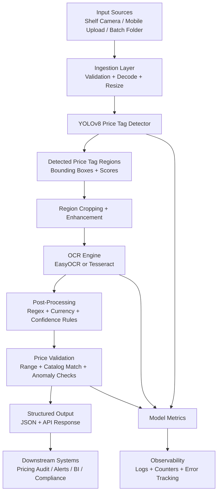

# High-Level Architecture

## Flow Summary

1. Input images arrive from shelf cameras, mobile uploads, or batch image folders.
2. The ingestion layer validates and normalizes the image before inference.
3. YOLOv8 detects shelf price-tag regions.
4. Detected regions are cropped and optionally enhanced for OCR.
5. OCR extracts the visible text from each detected price tag.
6. Post-processing parses prices, currencies, and confidence values.
7. Validation checks plausibility, expected values, and anomalies.
8. Structured results feed dashboards, APIs, alerts, and retail audit workflows.
